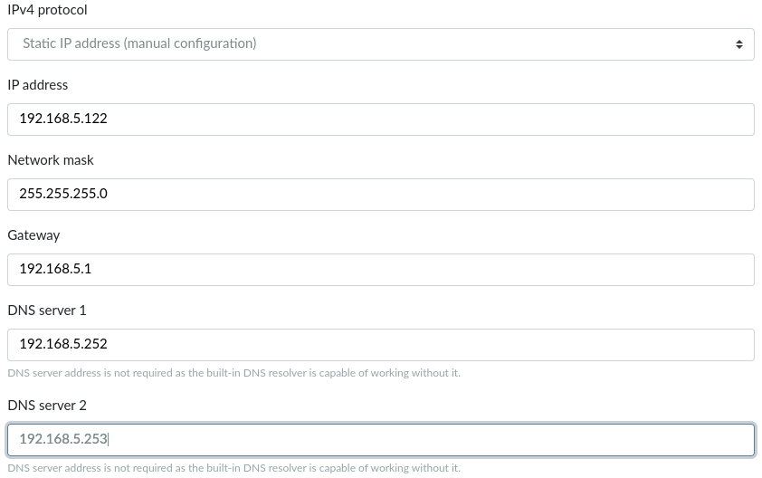
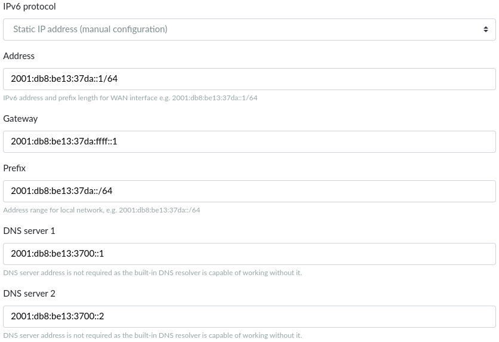
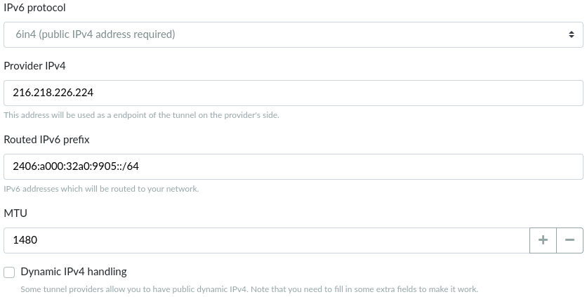
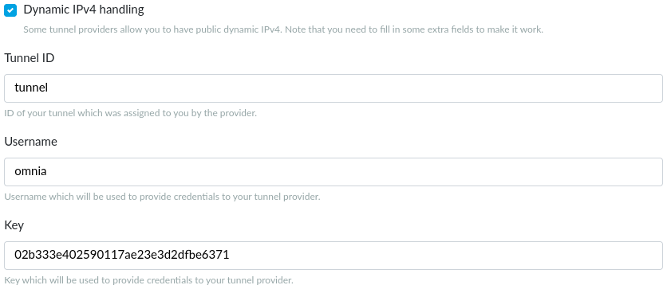

# WAN settings in reForis

Here you specify your WAN port settings. Usually, you can leave this options
untouched unless instructed otherwise by your
[internet service provider](https://en.wikipedia.org/wiki/Internet_service_provider).
Also, in case there is a cable or DSL modem connecting your router to
the network, it is usually not necessary to change this setting.

!!! note
    In some cases you need to use specific settings. Read bellow how to set up
    WAN networking properly.

## IPv4 settings

Three modes are supported for [IPv4](https://en.wikipedia.org/wiki/IPv4)
(can be chosen in the _IPv4 protocol_ drop-down list):

* [DHCP](https://en.wikipedia.org/wiki/Dynamic_Host_Configuration_Protocol)
  (automatic configuration)
* [PPPoE](https://en.wikipedia.org/wiki/Point-to-Point_Protocol_over_Ethernet)
  (for DSL bridges, modems etc.)
* Static IP address (manual configuration)

### DHCP configuration

This mode is the default and should be used unless your ISP instructs you to
do anything else. The IP address (including the network mask), the default
gateway and the [DNS](https://en.wikipedia.org/wiki/Domain_Name_System) servers
are acquired via DHCP.

!!! note
    In some cases may be required to use a specific hostname. If your ISP
    provides you such name (or instructs you how to select it) write it into
    the _DHCP hostname_ field.

### PPPoE configuration

In this mode, your IPv4 settings are obtained automatically. Your ISP should
provide you your authentication data (username and password) which you write
into the fields (_PAP/CHAP username_, _PAP/CHAP password_ respectively).

### Static IP address

After switching to this mode, several text fields are displayed. Write in
the values you have acquired from your ISP.

* _IP address_ (mandatory) – it's something like 192.168.5.122.
* _Network mask_ (mandatory) – something like 255.255.255.0.
* _Gateway_ (mandatory) – something like 192.168.5.1.
* _DNS server 1_ (optional) – may be left empty because there is
  a built-in DNS resolver capable to work without it. But some ISPs require
  customers to use specific DNS servers. If your ISP provided you such DNS
  server adress(es) write it in here (for more addresses, use the first one).
* _DNS server 2_ (optional) – if your ISP provided you more than one
  DNS server address write in the second one.

## IPv6 settings

Five modes are supported for [IPv6](https://en.wikipedia.org/wiki/IPv6) (can
be chosen in the _IPv6 protocol_ drop-down list):

* [DHCPv6](https://en.wikipedia.org/wiki/DHCPv6) (automatic configuration)
* Static IP address (manual configuration)
* [6to4](https://en.wikipedia.org/wiki/6to4) (public IPv4 address required)
* [6in4](https://en.wikipedia.org/wiki/6in4) (public IPv4 address required)
* Disable IPv6

### DHCPv6 configuration

This mode is the default and should be used if your ISP provides native IPv6
networking. In some cases may be required to use a specific DUID. If your ISP
provides you this value (or instructs you how to select it) write it into
the _Custom DUID_ field.

### Static IP address

This mode of native IPv6 is similar to its equivalent in the IPv4 world. Write
in the values you have acquired from your ISP.

* _IPv6 address_ (mandatory) – it's something like 2001:db8:be13:37da::1/64
  (this address includes the prefix length).
* _IPv6 gateway_ (mandatory) – something like 2001:db8:be13:37da:ffff::1.
* _IPv6 prefix_ (mandatory) – something like 2001:db8:be13:37da::/64.
* _DNS server 1_ (optional) – see above (but an IPv6 address is used here).
* _DNS server 2_ (optional) – see above.

### 6to4 configuration

6to4 is a transition mechanism for migrating from IPv4 to IPv6. It allows IPv6
packets to be transmitted over an IPv4 network without the need to configure
explicit tunnels. IPv6 packets are encapsulated into IPv4 packets for
transmission over the IPv4 network. 6to4 assigns a block of IPv6 addresses to
each IPv4 address.

6to4 can be used only if you have a static public IPv4 address. If you use this
address directly on your Turris it can be autodetected and no specific settings
are needed. But if you use a private address mapped to a public address you may
have to set it manually into the _Public IPv4_ field.

!!! tip
    Use 6to4 only if you can't use native IPv6 networking (DHCPv6 or static
    settings) because it has a couple of drawbacks.

### 6in4 configuration

6in4 is another transition mechanism, similar to 6to4 but using a different
mechanism. It encapsulates IPv6 packets on specially configured IPv4 links. 6in4
doesn't require a static public IPv4 address on your side but you need to have
a tunnel broker which provides you the values to write into the text fields.

* _Provider IPv4_ – the tunnel broker's IPv4 address to be used as the endpoint.
* _Routed IPv6 prefix_ – the IPv6 prefix to be routed to your network.
* _MTU_ – the maximum transmission unit; often may be left the default value
  (1480)
* _Dynamic IPv4 handling_ – check in if you have a dynamic public IPv4 address
  (this information should be obtained from your ISP) or if your tunnel broker
  requires to use your credentials (see bellow) instead of your static IPv4
  address.

If _Dynamic IPv4 handling_ is enabled it requires three additional fields
to be filled.

* _Tunnel ID_ – the tunnel identificator
* _Username_ – the tunnel user name
* _Key_ – the tunnel user key

Acquire these parameters from your tunnel broker.

!!! tip
    Use 6in4 only if you can't use native IPv6 networking (DHCPv6 or static
    settings) because it has a couple of drawbacks. 6in4 is more reliable than
    6to4 and easier to troubleshoot but requires a contract (often free
    of charge) with a tunnel broker.

### Disable IPv6

This mode disables IPv6 at all. Choose it if you don't want to use IPv6
networking.

## Custom MAC address

Some ISPs require to use specific
[MAC addresses](https://en.wikipedia.org/wiki/MAC_address).

You can check the _Custom MAC address_ checkbox and write the given MAC
address into the _MAC address_ field. Use hexadecimal format of numbers
separated by colons (e.g. 00:11:22:33:44:55).

## VLAN ID

Some ISPs require to set the VLAN ID.

You can check the _Enable VLAN_ checkbox and enter VLAN ID into the
_Set the VLAN ID_ field. VLAN ID must be a number in the range between 1 and
4094.

## Connection test

After you have set the WAN settings you can test the connectivity. Remember to
press the _Save_ button before you start the test. Note that sometimes it
takes a while before the connection is fully initialized. So it might be
useful to wait for a while before running this test.

What particular results mean:

* _IPv4 connectivity_ – your router has a working IPv4 address and can access
  machines inside the current network.
* _IPv4 gateway connectivity_ – your router has a working gateway IPv4 address
  and can access IPv4 machines on the Internet.
* _IPv6 connectivity_ – your router has a working IPv6 address and can access
  machines inside the current network.
* _IPv6 gateway connectivity_ – your router has a working gateway IPv6 address
  and can access IPv6 machines on the Internet.

This test does **NOT** include DNS checking. It can be tested on the DNS page.
