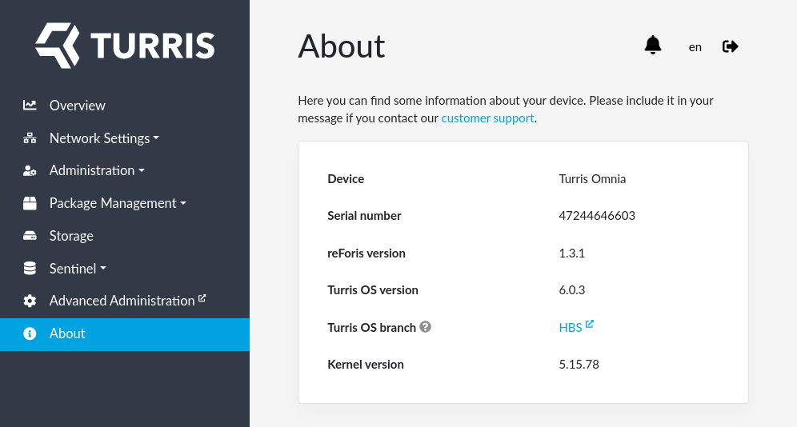
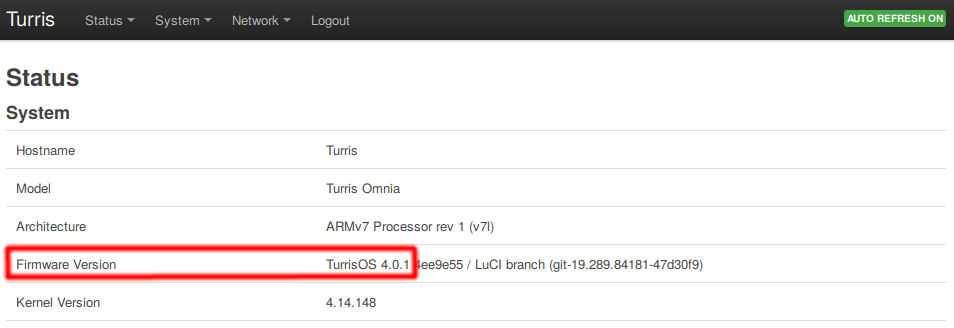

# Turris OS versions
Turris OS software is being released as a fixed set of packages for given version.

## History of major Turris OS versions

| Major Turris OS version | OpenWrt version             | Released  | Support terminated | Compatible routers                                                                                                                 |
|-------------------------|-----------------------------|-----------|--------------------|------------------------------------------------------------------------------------------------------------------------------------|
| 1.x.y                   | 12.09 (Attitude Adjustment) | ~1.2.2014 | 17.2.2015          | [Turris 1.x](models.md#turris-1x)                                                                                                  |
| 2.x.y                   | 14.07 (Barrier Breaker)     | 17.2.2015 | 24.5.2016          | [Turris 1.x](models.md#turris-1x)                                                                                                  |
| 3.x.y                   | 15.05 (Chaos Calmer)        | 24.5.2016 | 7.1.2022           | [Turris 1.x](models.md#turris-1x), [Omnia](models.md#turris-omnia)                                                                 |
| 4.x.y                   | 18.06                       | 5.10.2019 | 4.6.2020           | [Turris 1.x](models.md#turris-1x), [Omnia](models.md#turris-omnia), [Mox](models.md#turris-mox)                                    |
| 5.x.y                   | 19.07                       | 4.6.2020  | 19.10.2022         | [Turris 1.x](models.md#turris-1x), [Omnia](models.md#turris-omnia), [Mox](models.md#turris-mox), [Shield](models.md#turris-shield) |
| 6.x.y                   | 21.02                       | 19.10.2022  | -                | [Turris 1.x](models.md#turris-1x), [Omnia](models.md#turris-omnia), [Mox](models.md#turris-mox), [Shield](models.md#turris-shield)

For more detailed list of changes and versions history please see
[changelog](changelog.md).


### Versioning scheme

_Major_ version (5.x.y) denotes the OpenWrt version our Turris OS is based on.
_minor_ version (x.1.y) is released when some new features comes to the Turris OS,
and finally *fixup* version (x.y.4) correspond with a fixes, security patches
and correcting releases.


## How to find out version of Turris OS on your router?
There are multiple ways how you can find out version of Turris OS running in your
router. Few well advised ways are described here.

### In reForis web interface
Navigate to router's web interface (by default
[http://192.168.1.1](http://192.168.1.1)). You should be greeted with list of
web services running on router, please choose reForis. Next enter your password
if requested. This brings you to the reForis interface. In left menu column
click on _ABOUT_ and look for the _Turris OS version_ field.

!!!info
    You might be greeted with first setup guide instead of list of web services.
    In such case you have to configure your router first. Please see appropriate
    __First setup__ section in this documentation.



### In Luci web interface
Navigate to router's web interface and choose Luci. Enter your password if
required and you should be in Luci status page. Look for field `Firmware Version`
in table with status of system.



### Using SSH
You can connect to your router using SSH and view file `/etc/os-release`. The
easiest option is to just simply print it to console with `cat /etc/os-release`.

Alternatively for script usage you can source `/etc/os-release` and use variable
`$(VERSION_ID}`. Example follows:
```sh
. /etc/os-release
echo "${VERSION_ID}"
```

## Versions of Turris OS provided from factory
When Turris routers are shipped from factory they are provided with stable version
of Turris OS at that time. When you unpack new router or when you reset it to
factory settings then it is running Turris OS of that exact version (unless medkit
is used).

These versions have special form of support. For generic version there is limited
window of time when update is guaranteed. Updates from old versions can possibly
be problematic and Turris team can't ensure compatibility with every single
released version in past. The exception are factory versions. Updates from those
should work and be tested in scope of base install (no additional packages).

!!!note
    Although factory versions are supported and update path tested it might not be
    smooth simply because of possibly long update or problems during update Turris
    team can't do anything about. For best experience it is advised to always
    reflash router from flash drive/SD card with latest version of Turris OS.

### List of Turris OS factory versions
These are Turris OS versions flashed in factory and routers they were flashed to.

| Turris OS version | Used as factory for                                              |
|-------------------|------------------------------------------------------------------|
| _1.0_             | _Turris 1.0_ [^1]                                                |
| _2.1_             | _Turris 1.1_ [^1]                                                |
| 3.2.1             | Turris Omnia (CZ11NIC13)                                         |
| 3.8.3             | Turris Omnia (CZ11NIC20)                                         |
| 3.8.5             | Turris 1.0 and 1.1 after forced update [^1]                      |
| 4.0-beta1         | Turris Mox (early campaign SD cards)                             |
| 4.0.0             | Turris Mox (late campaign SD cards and early distribution)       |
| 4.0.1             | Turris Mox (late 2019 distribution) and Turris Omnia (CZ11NIC23) |
| 5.1.0             | Turris Shield                                                    |
| 6.0.0-alpha1      | Turris MOX Wi-Fi 6                                               |
| 6.0.0-alpha3      | Turris Omnia Wi-Fi 6                                             |

[^1]: Turris 1.x were originally sent out with Turris OS versions before 3.0 but
  because of DNS root key rollover there was a need to force update factory
  version in all of those routers. This happened with Turris OS 3.11. With this
  change Turris 1.x is considered to contain factory version Turris OS 3.8.5.
  Originally there was one more significant version of Turris OS for Turris 1.x
  and that was 3.7.3. This version was used to migrate from previous updater to
  updater-ng. With factory update to 3.8.5 it is no longer relevant.

### Compatibility of `project.turris.cz`

Old versions of Turris OS (up to 3.x) support the `project.turris.cz` portal.
It provides information about threats detected by users' routers using the
old data collection system [Ucollect](https://doc.turris.cz/doc/en/howto/collect).

Because of migration to the new security solution called
[Turris Sentinel](sentinel/intro.md),
new versions of Turris OS (4.0 and newer) are **no longer compatible** with
the mentioned portal. You can find various threat statistics on our new web
[Sentinel:view](https://view.sentinel.turris.cz/).
