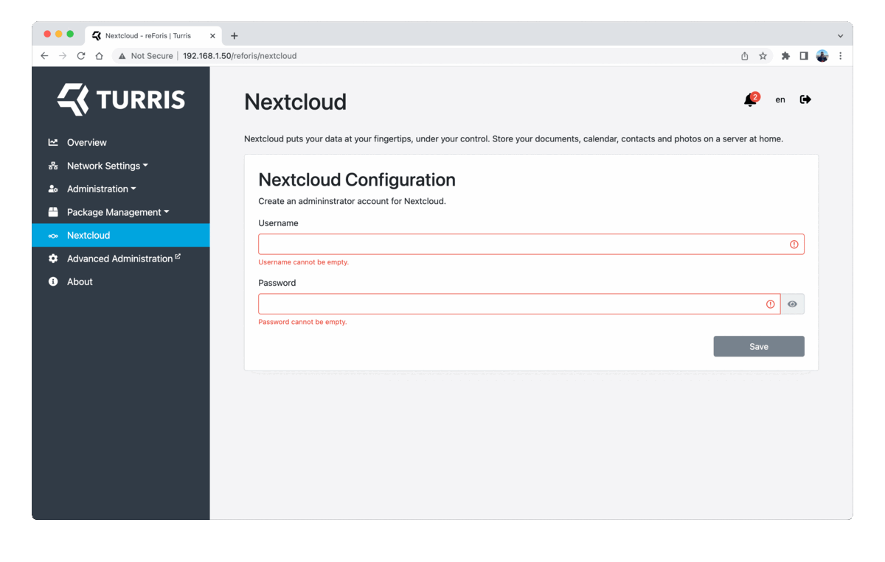
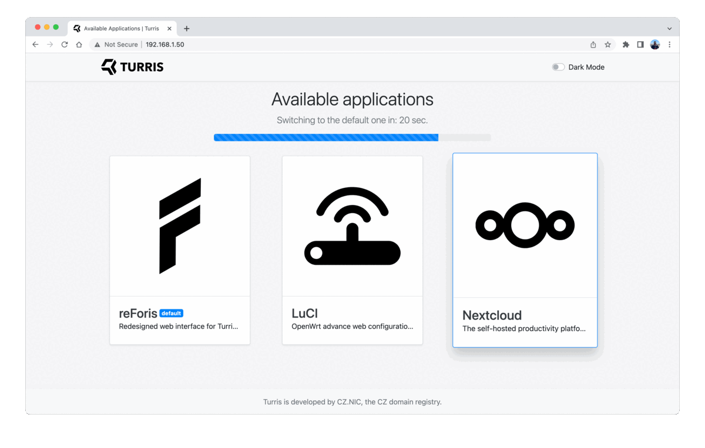

# Nextcloud server on Turris

## What is Nextcloud?

[Nextcloud](https://nextcloud.com) is an application that provides a nice web
interface to enable you to store data on your server. This data can be files,
calendars, contacts, a news feed, to-do lists, and much more. Files and PIM data
are accessible using standard protocols such as **WebDAV** or **CardDAV** and
**CalDAV**. It makes it easy to set up your computers or phones to synchronize
with your server so that you don't have to trust an external cloud provider with
your data.

!!! tip "Benefits of using Nextcloud"
    * An open source solution under your control
    * Synchronization and sharing of data made it easy
    * Mobile, desktop, and web clients
    * Monitors changes and allows document workflow management
    * A space for your calendar and contacts
    * Private voice and video calls with shared screens
    * Many additional third-party extensions

!!! warning
    Nextcloud is not available on Turris Shield.

## Requirements

It doesn't make much sense to use Nextcloud with just the small flash memory
already included in your router. In fact, **excessive writing to the internal
memory will lead to it getting worn out and damaged soon**. Also faster the
storage is, the snappier responses from the Nextcloud are. To get the most out
of Nextcloud, it’s best to get either an external drive or even an internal SSD.

To set up this external drive easily, use the [Storage
plugin](../../basics/reforis/storage-plugin/storage-plugin.md).

### Installation via reForis

Nextcloud can be set up quite easily using reForis.

The first step is to set up the storage you want to use for Nextcloud. Plug it
either into the USB 3.0 port or, in the case of Omnia, you can use an internal
mSATA port. Then use the [Storage
plugin](../../basics/reforis/storage-plugin/storage-plugin.md) to set it up. You
will be asked to reboot your router, so do so.

The next step is to check Nextcloud in _Package Lists_ (_Package Management_ →
_Packages_ tab). After doing so, your router will install all necessary
packages.


The last step is to go to the _Nextcloud_ tab, which will appear after
successful installation, you will be presented with a dialog to set your admin
username and password.

If you get the setup dialog, you can enter your desired credentials, and you are
done. reForis will finish your Nextcloud setup. It can take a while, depending
on the speed of your drive.



Once done, you get a link directly to your ready-to-use Nextcloud instance, or
you can access it from the [Landing page](../../basics//landing-page.md).



### Manual installation from CLI

Nextcloud is already included in our repositories, so you can get it simply by
installing the package `nextcloud-install` by issuing the following commands:

```
echo 'Install("nextcloud-install")' > /etc/updater/conf.d/nextcloud.lua
pkgupdate
```

It will install all the required dependencies, the Nextcloud itself, and a
simple script to help you with the basic setup. Alternatively, you can install
only the package `nextcloud` and set up everything by yourself. If you decide to
use the setup script for simplicity just call the following command after
installation is complete:

```
nextcloud_install
```

This script will create the Nextcloud database and add a user on the MariaDB
server running on your router, enable it and enable php support in Lighttpd as
well. It will also create an admin account on your new Nextcloud server.

## Using Nextcloud

Once installed, you can access your Nextcloud instance by using URL like
`http://your_router_lan_ip/nextcloud`. If your computer supports
[zeroconf](https://en.wikipedia.org/wiki/Zero-configuration_networking), you
could simplify the access by using the URL <http://turris.local/nextcloud>.

You can also enable access to your Nextcloud from anywhere on the Internet. You
can either use VPN, which can be set up [easily from
reForis](../../basics/apps/openvpn-server/openvpn.md), or you need to open up
some ports in your firewall. The second option would allow anybody (including
attackers) to try to log in to your Nextcloud instance and – if you do not
change the Lighttpd configuration – to LuCI and reForis. Please do not do that
unless you are sure what you are doing.

Also, bear in mind that if you are using Nextcloud from our repositories, **you
shouldn't update the Nextcloud core manually**, as that would get overwritten by
the next update. So update just your extra apps and leave the core to us.
